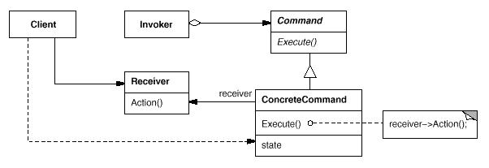

 # 设计模式示例记录
 
 

### 结构型  

1. 组合模式

一 参与者
1.Component 为组合中的对象声明接口。 在适当的情况下，实现所有类共有接口的缺省行为。 声明一个接口用于访问和管理Component的子组件。 (可选)在递归结构中定义一个接口，用于访问一个父部件，并在合适的情况下实现它。

2.Leaf 在组合中表示叶节点对象，叶节点没有子节点。 在组合中定义节点对象的行为。 
3.Composite 定义有子部件的那些部件的行为。 存储子部件。 在Component接口中实现与子部件有关的操作。 
4.Client 通过Component接口操纵组合部件的对象。

二、适用性
1.你想表示对象的部分-整体层次结构。

2.你希望用户忽略组合对象与单个对象的不同，用户将统一地使用组合结构中的所有对象。

2. 装饰模式

一 参与者
1、Component是基类。通常是一个抽象类或者一个接口，定义了属性或者方法，方法的实现可以由子类实现或者自己实现。通常不会直接使用该类，而是通过继承该类来实现特定的功能，
   它约束了整个继承树的行为。比如说，如果Component代表人，即使通过装饰也不会使人变成别的动物。 
2、ConcreteComponent是Component的子类，实现了相应的方法，它充当了“被装饰者”的角色。 
3、Decorator也是Component的子类，它是装饰者共同实现的抽象类（也可以是接口）。比如说，Decorator代表衣服这一类装饰者，那么它的子类应该是T恤、裙子这样的具体的装饰者。 
4、ConcreteDecorator是Decorator的子类，是具体的装饰者，由于它同时也是Component的子类，因此它能方便地拓展Component的状态（比如添加新的方法）

二 适用性
（1）拓展性十分良好，在不影响其他对象的情况下，以动态、透明的方式给单个对象添加职责。
    通过使用不同的装饰类来使得对象具有多种多样的属性，灵活性比直接继承好。

（2）处理那些可以撤消的职责。

（3）当不能采用生成子类的方法进行扩充时。一种情况是，可能有大量独立的扩展，为支持每一种组合将产生大量的 子类，使得子类数目呈爆炸性增长。
   另一种情况可能是因为类定义被隐藏，或类定义不能用于生成子类
   
 (4) 缺点，那就是会出现很多小类，即装饰类，使程序变得复杂

三 适配器模式

    模式所涉及的角色有：

　　　　目标(Target)角色：这就是所期待得到的接口。注意：由于这里讨论的是类适配器模式，因此目标不可以是类。

　　　　源(Adapee)角色：现在需要适配的接口。

　　　　适配器(Adaper)角色：适配器类是本模式的核心。适配器把源接口转换成目标接口。显然，这一角色不可以是接口，而必须是具体类

   适用性：
    - 优点
   　　更好的复用性
   　　系统需要使用现有的类，而此类的接口不符合系统的需要。那么通过适配器模式就可以让这些功能得到更好的复用。
   
   　　更好的扩展性
   　　在实现适配器功能的时候，可以调用自己开发的功能，从而自然地扩展系统的功能。
   
    - 缺点
   　　过多的使用适配器，会让系统非常零乱，不易整体进行把握。比如，明明看到调用的是A接口，其实内部被适配成了B接口的实现，
      一个系统如果太多出现这种情况，无异于一场灾难。因此如果不是很有必要，可以不使用适配器，而是直接对系统进行重构

 ### 行为型
  
1 命令模式

将一个请求封装为一个对象，从而可以使用不同的请求对客户端进行参数化。对请求排队或记录请求日志，以及支持撤销的操作

命令对象有： 命令发布者 --> 命令  --> 命令接受者

二、适用性

1.当抽象出待执行的动作以参数化某个对象的时候。

2.当需要在不同的时刻指定、排列和执行请求的时候。

3.当需要支持撤销操作的时候。

4.当需要支持修改日志的时候。系统崩溃时，这些修改可以重做一遍。

5.当用构建在原语操作上的高层操作构造一个系统的时候

2.
  
  角色：
  - 抽象处理者(Handler)角色：定义出一个处理请求的接口。如果需要，接口可以定义 出一个方法以设定和返回对下家的引用。
这个角色通常由一个Java抽象类或者Java接口实现。上图中Handler类的聚合关系给出了具体子类对下家的引用，抽象方法handleRequest()规范了子类处理请求的操作。
   
  - 具体处理者(ConcreteHandler)角色：具体处理者接到请求后，可以选择将请求处理掉，或者将请求传给下家。
    由于具体处理者持有对下家的引用，因此，如果需要，具体处理者可以访问下家

  优缺点：
  